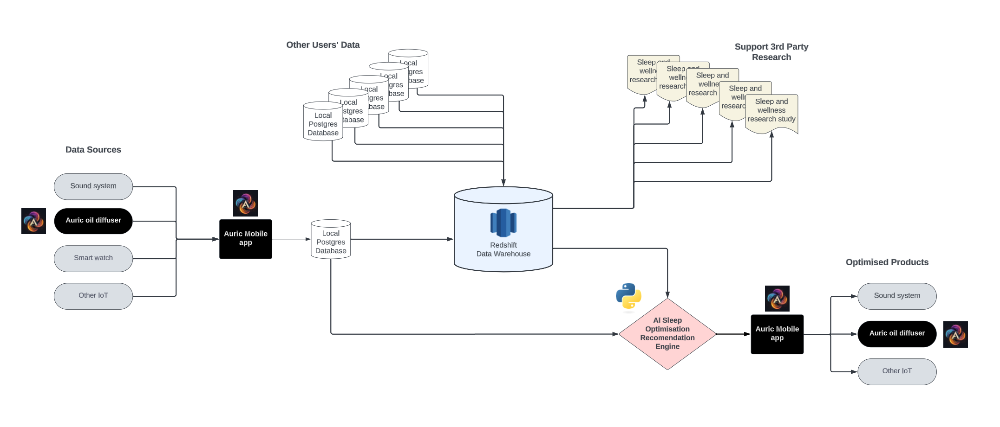

# Hays x SCFG Hackathon 2023 - Auric

Auric is the world's first AI- powered personal essential oil diffuser, synthesizing aromatherapy, biomedical engineering, and artificial intelligence. Drawing real-time biofeedback data from wearable tech, Auric tailors unique, essential oil experiences that align with individual wellness needs.

This repository houses the data engineering and artifically intelligence logic that Auric uses. Currently we are in the concept phase.

## Example Archetecture: Sleep Optimisation

As shown in the diagram above, Auric's sleep optimisation system works with combining historical data from the individual with big data from 1000s of other users to provide both high quality and high quantity data, to be fed into our AI model used to predict the best mix of Auric oils for the user to sleep peacfully. 

See 'models' directory for examples of AI models, and 'tables' directory for example of input data.

## Looking Ahead

To complete the task of creating the Auric Wellness Signature that incorporates the eight essential oils and the 52 rituals, along with user biometrics from a smartwatch, we see the following components would also need to be included:

### Data Collection and Preprocessing:
Gather user biometric data from the smartwatch (e.g., heart rate, sleep patterns, activity levels).
Collect data on the eight essential oils, their properties, and the 52 rituals.
Preprocess and clean the data to ensure consistency and eliminate any noise or missing values.

### User Interface and App Development:
Build a user-friendly interface for users to input their biometric data and wellness goals.
Design an interactive app that allows users to explore and select different wellness categories (calm, focus, energy, sleep).
Integrate the machine learning models to provide personalized auric mix recommendations based on the user's biometric data and wellness goals.

### Database and Storage:
Set up a database to store user profiles, biometric data, and preferences securely.
Utilize cloud-based storage to save the essential oil properties, rituals, and other relevant information.

### Visualization and Data Analysis:
Develop visualizations to display user biometric trends and how they relate to different wellness situations.
Create visual representations of the recommended auric mixes to help users understand the compositions better.

### Security and Privacy:
Ensure that user data is securely stored and accessed only by authorized personnel.
Implement encryption and data anonymization techniques to protect user privacy.
